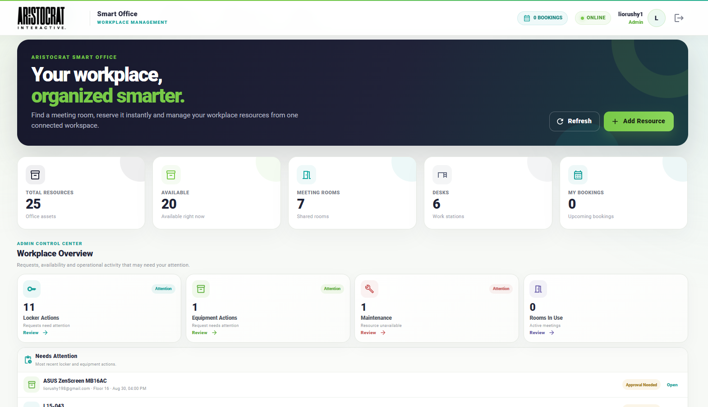
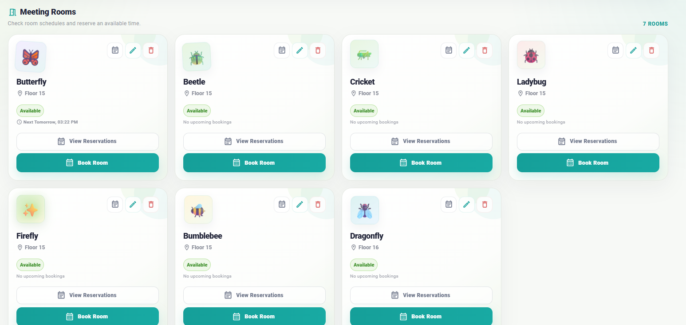
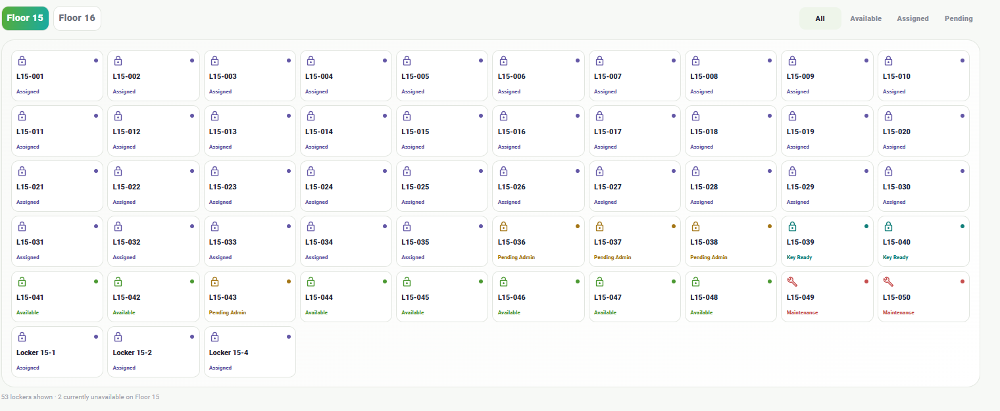
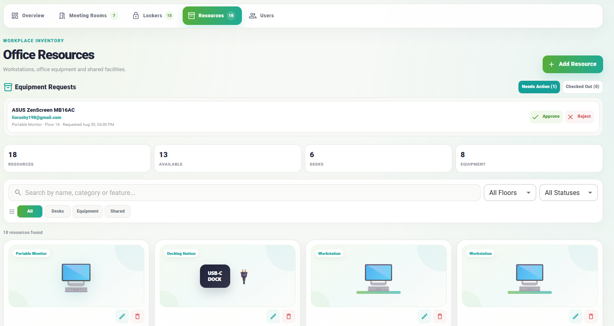
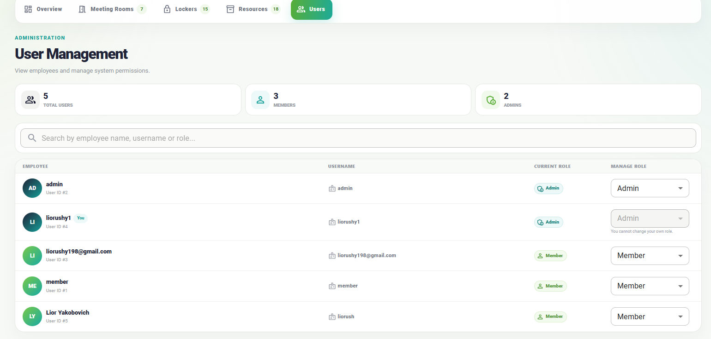
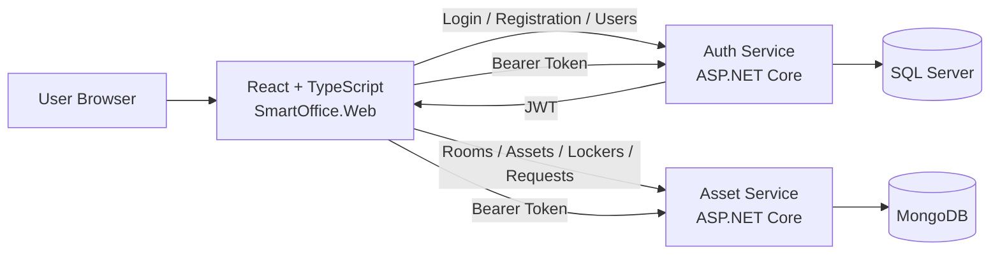

# SmartOffice


[](https://github.com/LiorYakoboich/SmartOffice/actions/workflows/ci.yml)


**SmartOffice** is a full-stack workplace management platform for managing meeting rooms, lockers, office resources, equipment requests, reservations, users and administrative workflows from one centralized application.


The system is built with a service-oriented backend architecture using **ASP.NET Core, React, TypeScript, SQL Server, MongoDB, JWT authentication, Docker, automated testing and GitHub Actions CI**.


SmartOffice supports two roles:


- **Member** — books rooms and requests workplace resources.

- **Admin** — manages resources, requests, users and operational workflows.


Authorization is enforced on the backend as well as reflected in the frontend UI.


---


## Application Preview


### Admin Dashboard


The Admin dashboard provides a high-level operational view of workplace activity, including resources, meeting rooms, pending actions and maintenance.





---


### Meeting Rooms


Users can browse meeting rooms, inspect reservations and book available time slots. Admins can also manage room configuration and status.





---


### Locker Management


The locker center provides a floor-based visual inventory with workflow-aware statuses such as available, assigned, pending approval, key ready and maintenance.





---


### Office Resources


Admins can manage office equipment and shared resources while processing equipment requests directly from the resource management screen.





---


### User Management


Admins can search users, review role distribution and manage Member/Admin permissions.





---


## Key Features


### Authentication & Authorization


SmartOffice includes a complete authentication and authorization flow:


- User registration

- User login

- Secure password hashing

- JWT token generation

- JWT Bearer authentication

- Member and Admin roles

- Backend role-based authorization

- Protected Admin endpoints

- Role-aware frontend navigation

- Admin user management

- Protection against Admin self-demotion

- Public registration restricted to the Member role


Passwords are never stored in plain text.


---


## Meeting Room Management


Members can:


- Browse meeting rooms

- View room details and features

- View existing reservations

- Reserve available time slots

- Cancel their own reservations


Admins can:


- Manage room information

- Change operational status

- Cancel reservations

- Place rooms under maintenance


The backend validates reservation rules and prevents:


- Overlapping bookings

- Reservations in the past

- Invalid date/time ranges

- Reservations for rooms under maintenance

- Conflicting reservations


Room availability can also be derived from reservation activity rather than relying only on a manually stored status.


---


## Locker Management


SmartOffice contains a structured locker workflow across two office floors.


### Locker Inventory


```text

Floor 15 → 50 lockers

Floor 16 → 50 lockers

```


### Locker Request Workflow


```text

Pending

   ↓

Approved

   ↓

Collected

   ↓

Returned

```


A request may also become:


```text

Rejected

Cancelled

```


### Member Capabilities


Members can:


- Browse lockers by floor

- Filter locker availability

- Request an available locker key

- Track their current request

- Cancel an eligible request


### Admin Capabilities


Admins can:


- Review pending locker requests

- Approve requests

- Reject requests

- Mark keys as collected

- Mark keys as returned

- Manage locker availability

- Place lockers into maintenance

- View active assignments


### Business Rules


The backend prevents:


- Multiple active locker workflows for the same member

- Multiple active requests for the same locker

- Requests for unavailable lockers

- Unauthorized request cancellation

- Taking a locker offline during an active workflow


---


## Equipment Request Workflow


Members can request eligible office equipment.


The request lifecycle is:


```text

Pending

   ↓

Approved

   ↓

Collected

   ↓

Returned

```


Admins can:


- Approve requests

- Reject requests

- Mark equipment as collected

- Mark equipment as returned


When equipment is collected:


```text

Asset Status → In Use

```


When it is returned:


```text

Asset Status → Available

```


This keeps request state and physical asset state synchronized.


The system also prevents conflicting active requests and invalid workflow transitions.


---


## Office Resource Management


SmartOffice supports multiple types of workplace assets, including:


- Equipment

- Desks

- Shared resources

- Meeting rooms


Resource information can include:


- Name

- Type

- Category

- Floor

- Description

- Features

- Operational status


Admins can:


- Create resources

- Update resources

- Delete resources

- Change availability and maintenance state


Members can browse resources and interact with the workflows permitted for their role.


---


## Admin Dashboard


The Admin dashboard acts as an operational control center.


It highlights:


- Locker actions requiring attention

- Equipment requests requiring attention

- Resources under maintenance

- Rooms currently in use

- Recent request activity

- Resource totals

- Current availability


This allows an Admin to quickly identify pending work without visiting every management section individually.


---


# Architecture


SmartOffice separates identity management from workplace resource management into two backend services.





---


## Backend Services


| Service | Responsibility | Database |

| --- | --- | --- |

| `SmartOffice.AuthService` | Authentication, registration, users, roles and JWT generation | SQL Server |

| `SmartOffice.AssetService` | Assets, rooms, reservations, lockers and equipment workflows | MongoDB |


### AuthService


Responsible for:


- Registration

- Login

- Password hashing

- JWT generation

- User management

- Role management


### AssetService


Responsible for:


- Office assets

- Meeting rooms

- Reservations

- Lockers

- Locker requests

- Equipment requests

- Resource workflow state


---


## Frontend Architecture


`SmartOffice.Web` is a React + TypeScript single-page application.


The frontend is responsible for:


- Authentication state

- Role-aware navigation

- API communication

- Application state

- Dashboard rendering

- Forms and dialogs

- Resource management UI

- Reservation workflows

- Locker workflows

- Equipment workflows


Application state is managed using **MobX**.


The UI is built with **Material UI**.


---


# Technology Stack


## Backend


- C#

- .NET 10

- ASP.NET Core Web API

- Entity Framework Core

- ASP.NET Core Identity `PasswordHasher`

- JWT Bearer Authentication

- SQL Server

- MongoDB


## Frontend


- React

- TypeScript

- Vite

- Material UI

- MobX

- Fetch API


## Testing


- xUnit

- ASP.NET Core `WebApplicationFactory`

- Entity Framework Core InMemory provider

- MongoDB integration testing

- Vitest

- React Testing Library

- jsdom


## DevOps & Infrastructure


- Docker

- Docker Compose

- Git

- GitHub

- GitHub Actions

- Automated CI

- ASP.NET Core Health Checks


---


# Automated Testing


SmartOffice currently contains **69 automated tests** across the backend and frontend.


| Test Suite | Tests |

| --- | ---: |

| AuthService | 14 |

| AssetService | 42 |

| React Frontend | 13 |

| **Total** | **69** |


The automated test suite covers several layers of the application.


### Authentication


- User registration

- Password hashing

- Login validation

- Case-insensitive usernames

- Duplicate usernames

- Invalid passwords

- JWT generation


### User Management


- User listing

- Role changes

- Invalid role validation

- Self-demotion protection

- Legacy user display behavior


### Reservations


- Reservation creation

- Overlapping reservation detection

- Back-to-back reservations

- Invalid time ranges

- Past reservations

- Maintenance protection

- Reservation ownership

- Cancellation authorization


### Lockers


- Locker requests

- Active-request constraints

- Locker availability

- Request ownership

- Cancellation rules

- Approval

- Rejection

- Collection

- Return workflow

- Locker status management


### Equipment


- Equipment requests

- Asset type validation

- Asset availability validation

- Duplicate request protection

- Request cancellation

- Approval

- Rejection

- Equipment collection

- Asset status changes

- Equipment return


### HTTP Authorization Integration Tests


The AssetService also includes HTTP pipeline integration tests using `WebApplicationFactory`.


These verify scenarios such as:


```text

No Token       → Admin Endpoint  → 401 Unauthorized


Member Token   → Admin Endpoint  → 403 Forbidden


Admin Token    → Admin Endpoint  → 200 OK


Admin Token    → Member Endpoint → 403 Forbidden


Member Token   → Member Endpoint → 200 OK

```


This verifies authorization through the actual ASP.NET Core HTTP pipeline rather than testing controller methods alone.


### Frontend Tests


React tests verify:


- Admin-only navigation

- Member navigation restrictions

- Dashboard navigation behavior

- Locker Admin controls

- Equipment Admin controls

- Role-specific component rendering


---


# Continuous Integration


SmartOffice uses **GitHub Actions** to automatically validate the application on every push and pull request to `main`.


The workflow contains independent Backend and Frontend jobs.


```text

Push / Pull Request

        │

        ├── Backend Tests

        │     ├── Start MongoDB

        │     ├── Setup .NET 10

        │     ├── Restore dependencies

        │     ├── Run AuthService tests

        │     └── Run AssetService tests

        │

        └── Frontend Tests & Build

              ├── Setup Node.js

              ├── npm ci

              ├── Run Vitest

              └── Production build

```


A failing test or build causes the GitHub Actions workflow to fail.


Workflow:


```text

.github/workflows/ci.yml

```


Current workflow status is displayed at the top of this README.


---


# Health Checks


Both backend services expose liveness and readiness endpoints.


## AuthService


```http

GET https://localhost:7195/health/live

GET https://localhost:7195/health/ready

```


`/health/live`


Checks whether the AuthService process is running.


`/health/ready`


Checks whether AuthService is ready to serve requests and verifies connectivity to **SQL Server**.


---


## AssetService


```http

GET https://localhost:7244/health/live

GET https://localhost:7244/health/ready

```


`/health/live`


Checks whether the AssetService process is running.


`/health/ready`


Checks whether AssetService is ready to serve requests and verifies connectivity to **MongoDB**.


Separating liveness from readiness makes the services more suitable for container orchestration and production monitoring.


---


# API Overview


| Area | Base Endpoint |

| --- | --- |

| Authentication | `/api/auth` |

| User Management | `/api/users` |

| Assets | `/api/assets` |

| Reservations | `/api/reservations` |

| Lockers | `/api/lockers` |

| Equipment Requests | `/api/equipment-requests` |


Security-sensitive operations are protected at the API level.


The frontend is not treated as a security boundary.


---


# Project Structure


```text

SmartOffice/

│

├── .github/

│   └── workflows/

│       └── ci.yml

│

├── docs/

│   └── screenshots/

│       ├── dashboard-admin.png

│       ├── meeting-rooms.png

│       ├── lockers.png

│       ├── resources.png

│       └── user-management.png

│

├── SmartOffice.AuthService/

│   ├── Controllers/

│   ├── Data/

│   ├── DTOs/

│   ├── Health/

│   ├── Models/

│   └── Program.cs

│

├── SmartOffice.AuthService.Tests/

│

├── SmartOffice.AssetService/

│   ├── Controllers/

│   ├── Data/

│   ├── DTOs/

│   ├── Health/

│   ├── Models/

│   └── Program.cs

│

├── SmartOffice.AssetService.Tests/

│

├── SmartOffice.Web/

│   ├── src/

│   │   ├── components/

│   │   ├── pages/

│   │   ├── stores/

│   │   └── test/

│   │

│   └── package.json

│

├── docker-compose.yml

├── .env.example

├── .gitignore

└── README.md

```


---


# Getting Started


## Prerequisites


Install the following:


- .NET 10 SDK

- Node.js 24+

- npm

- Docker Desktop

- Git


---


## 1. Clone the Repository


```bash

git clone https://github.com/LiorYakoboich/SmartOffice.git

cd SmartOffice

```


---


## 2. Configure Docker Environment


Create a local `.env` file from the example:


### Windows PowerShell


```powershell

Copy-Item .env.example .env

```


Configure a local SQL Server password inside `.env`:


```env

MSSQL_SA_PASSWORD=YOUR_STRONG_LOCAL_PASSWORD

```


`.env` is excluded from Git and should not be committed.


---


## 3. Start the Databases


```bash

docker compose up -d

```


Docker starts:


```text

SQL Server → localhost:1433

MongoDB    → localhost:27017

```


Check container status:


```bash

docker compose ps

```


---


## 4. Configure AuthService


SmartOffice uses .NET User Secrets for local sensitive configuration.


Configure the SQL Server connection string:


```powershell

dotnet user-secrets set "ConnectionStrings:DefaultConnection" "Server=localhost,1433;Database=SmartOfficeAuthDb;User Id=sa;Password=YOUR_STRONG_LOCAL_PASSWORD;TrustServerCertificate=True;" --project SmartOffice.AuthService

```


Configure a JWT signing key:


```powershell

dotnet user-secrets set "Jwt:Key" "YOUR_LOCAL_DEVELOPMENT_JWT_KEY" --project SmartOffice.AuthService

```


---


## 5. Configure AssetService


Configure MongoDB:


```powershell

dotnet user-secrets set "MongoDb:ConnectionString" "mongodb://localhost:27017" --project SmartOffice.AssetService

```


The AssetService validates JWT tokens created by AuthService.


Therefore, configure the **same JWT signing key**:


```powershell

dotnet user-secrets set "Jwt:Key" "YOUR_LOCAL_DEVELOPMENT_JWT_KEY" --project SmartOffice.AssetService

```


---


## 6. Start AuthService


```bash

dotnet run --project SmartOffice.AuthService

```


Development URL:


```text

https://localhost:7195

```


---


## 7. Start AssetService


Open another terminal:


```bash

dotnet run --project SmartOffice.AssetService

```


Development URL:


```text

https://localhost:7244

```


---


## 8. Start the Frontend


Open another terminal:


```bash

cd SmartOffice.Web

npm ci

npm run dev

```


Frontend:


```text

http://localhost:5173

```


---


# Running Tests


## AuthService


```bash

dotnet test SmartOffice.AuthService.Tests

```


Expected:


```text

14 tests passed

```


---


## AssetService


MongoDB must be running before executing the AssetService integration tests.


```bash

dotnet test SmartOffice.AssetService.Tests

```


Expected:


```text

42 tests passed

```


---


## Frontend


```bash

cd SmartOffice.Web

npx vitest run

```


Expected:


```text

13 tests passed

```


---


# Security


SmartOffice applies multiple security practices:


- Passwords are hashed before storage

- Plain-text passwords are never persisted

- JWT signatures are validated

- JWT issuer is validated

- JWT audience is validated

- JWT lifetime is validated

- Backend endpoints enforce role authorization

- Admin operations are protected server-side

- Public registration cannot create Admin users

- Admin self-demotion is protected

- Local secrets are stored outside tracked configuration

- `.env` is excluded from Git

- Development secrets can be managed using .NET User Secrets


Production environments should use a dedicated secret-management platform rather than local User Secrets or development environment files.


---


# Engineering Decisions


## Why SQL Server for Authentication?


Authentication and user data are strongly structured and relational.


SQL Server with Entity Framework Core provides:


- Structured user records

- Strong schema support

- Familiar relational querying

- Straightforward persistence for authentication data


For this reason, SmartOffice keeps identity-related data in its own SQL-backed service.


---


## Why MongoDB for Workplace Resources?


Office assets and operational workflows contain flexible data structures and evolve independently from authentication.


MongoDB provides a convenient document model for:


- Assets

- Meeting rooms

- Reservations

- Lockers

- Locker requests

- Equipment workflows


This also demonstrates using different persistence technologies where they fit different parts of the system.


---


## Why Separate Backend Services?


Authentication and workplace resource management belong to different domains.


Separating them provides:


- Clearer responsibilities

- Independent persistence

- Smaller service boundaries

- Easier future scaling

- Reduced coupling


AuthService issues JWT tokens while AssetService validates them.


---


## Why Enforce Authorization on the Backend?


The frontend hides functionality users cannot access, but UI visibility is not a security mechanism.


For example:


```text

Member → Admin API Endpoint → Forbidden

```


Role restrictions are therefore enforced again inside ASP.NET Core.


The integration test suite verifies this behavior through real HTTP requests.


---


## Why Separate Liveness and Readiness?


A process may be running while its required database is unavailable.


SmartOffice distinguishes:


```text

Liveness

    ↓

Is the API process running?


Readiness

    ↓

Can the API actually serve requests?

```


AuthService readiness checks SQL Server.


AssetService readiness checks MongoDB.


This approach is commonly used in containerized environments and production monitoring.


---


# Future Improvements


Possible future enhancements include:


- Containerizing AuthService, AssetService and the React frontend

- Full application startup through Docker Compose

- Refresh-token support

- Secure HTTP-only cookie authentication

- Database-level unique username constraints

- MongoDB indexes for workflow constraints

- Stronger concurrency protection

- Structured API error responses

- React Router navigation

- Centralized logging

- Metrics and observability

- Cloud deployment

- End-to-end browser testing

- Automated deployment pipeline


---


# What This Project Demonstrates


SmartOffice was designed as more than a CRUD application.


The project demonstrates practical experience with:


- Full-stack application development

- React and TypeScript

- ASP.NET Core APIs

- C#

- SQL and NoSQL databases

- Authentication

- JWT

- Role-based authorization

- Business-rule validation

- Service separation

- State management

- Automated testing

- HTTP integration testing

- Docker

- Health monitoring

- Continuous Integration

- Git and GitHub workflows


---


## Repository


**GitHub:**  

https://github.com/LiorYakoboich/SmartOffice


